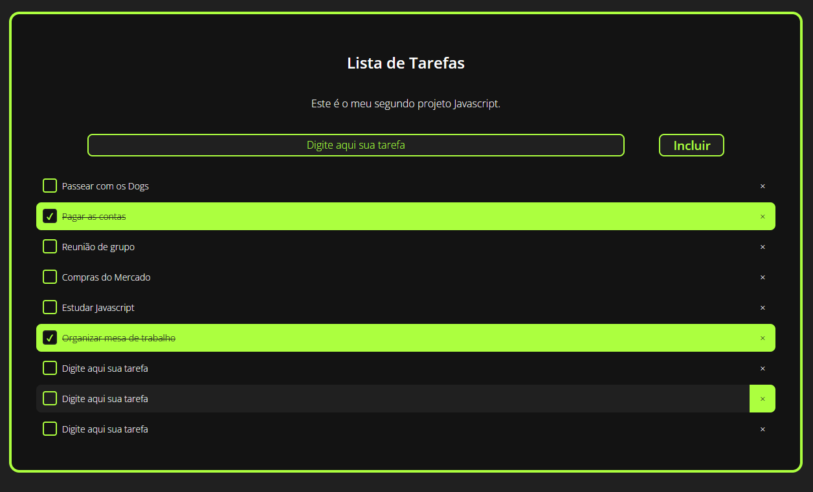

# ***Lista de tarefas*** (To-do list) :ballot_box_with_check:

### Link do repositório original:

https://github.com/stebsnusch/basecamp-javascript/tree/main/introducao-ao-javascript/to-do%20list

#### Proposta do projeto:

Para este projeto a proposta é que fosse criada uma lista de tarefas com as seguintes características:

- Campo de `input` de texto para inclusão das tarefas na lista;
- Botão para adição dos textos digitados no campo input e inclusão de `checkbox` ao texto adicionado na lista;
- Quando o usuário selecionar o checkbox, o item correspondente deve ficar com o texto riscado. (ex.: ~~tarefa completa~~).

#### Acréscimos:

- Estilização geral da pagina para melhor apresentação do projeto e facilidade de uso;

- Além de riscar o texto, quando selecionada a tarefa fica com cor de destaque;

- Ao transitar o mouse entre as tarefas foi criado o efeito de contraste com cores aproximadas;

- Para aprimorar a funcionalidade da lista, foi criado `botão "X"` para que as tarefas possam ser removidas;

- Caso o usuário tente incluir uma tarefa em branco, será apresentada mensagem com a informação: 

  "Campo em branco".

#### Print da Tela:

